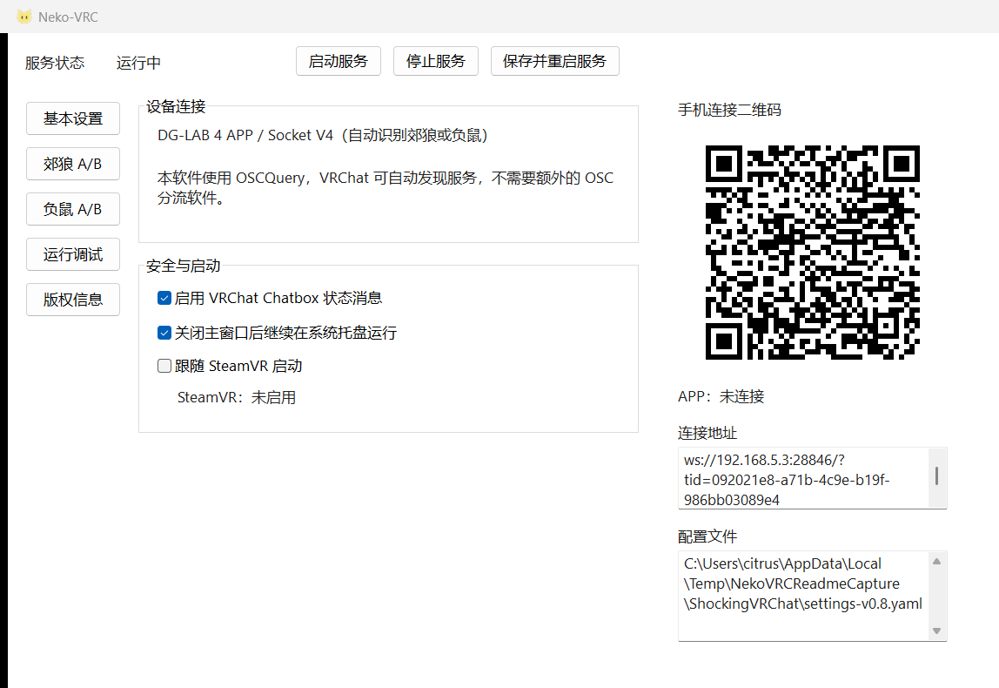
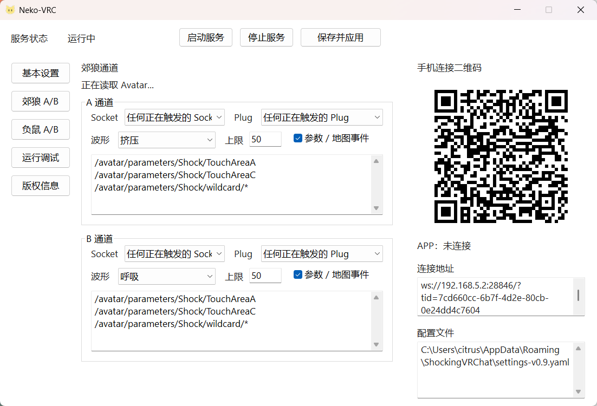
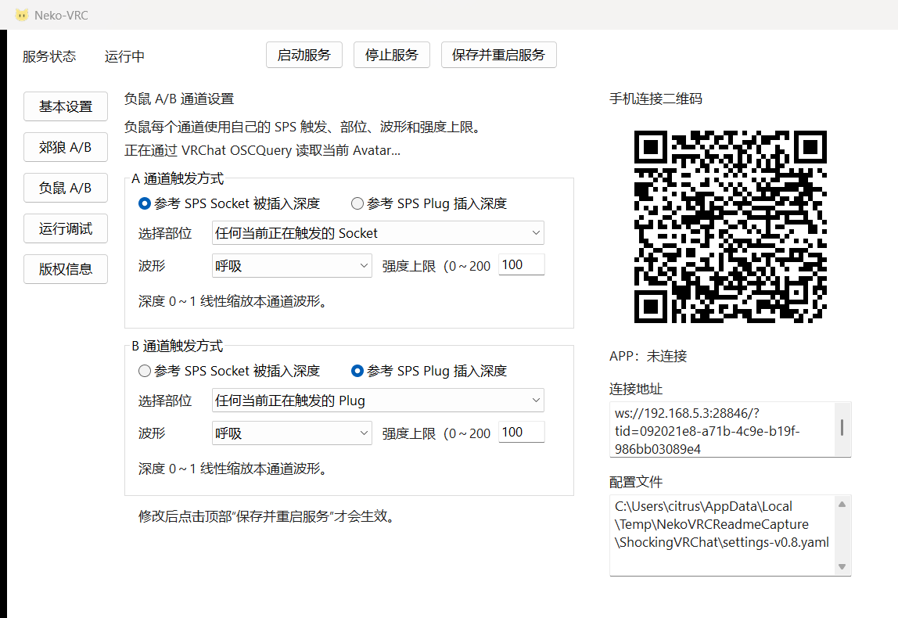
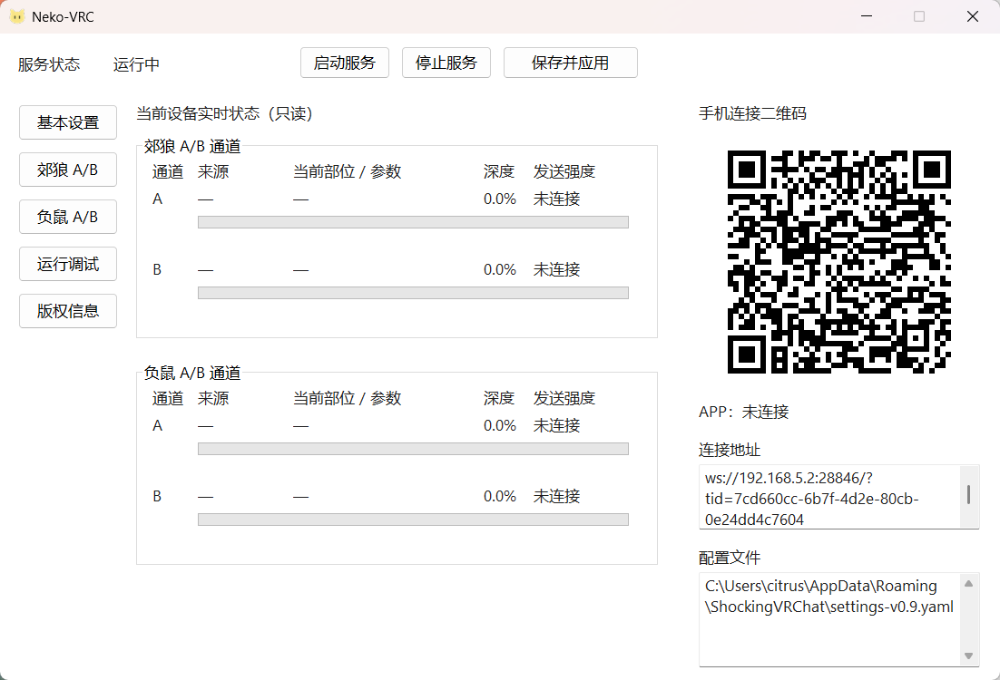
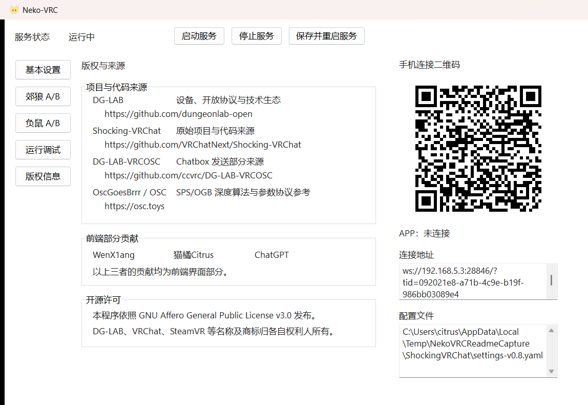

# Neko-VRC

| General | Coyote A/B | Opossum A/B | Runtime Debug | Copyright |
|---|---|---|---|---|
|  |  |  |  |  |

> This document is translated by AI.

A small tool that reads SPS/OGB penetration depth from VRChat OSC and controls either a Coyote DG-LAB 3.0 or an Opossum vibration controller.

> [!CAUTION]
> You must read and agree to the [Safety Precautions](doc/dglab/SafetyPrecautions.md) before using this tool!

Our VRChat Group: [ShockingVRC https://vrc.group/SHOCK.2911](https://vrc.group/SHOCK.2911)

## Usage

1. Go to [Project Releases](https://github.com/NekoCitrus/Neko-VRC/releases) to download the latest Neko-VRC build.
2. Run the exe. The lightweight desktop window opens and starts the background services automatically.
3. Under **Coyote A/B** and **Opossum A/B**, configure Socket, Plug, extra parameters, waveform, and strength limit for each channel.
4. Select **Save and apply**. The existing APP connection stays connected.
5. Connect the Coyote or Opossum to DG-LAB 4 APP over Bluetooth, open Socket control, and scan the QR code.
6. If background operation is enabled, closing the window hides it to the real Windows notification area. Use the tray menu to reopen or exit.

## Desktop UI

- **General:** Chatbox, background operation, and SteamVR auto-start. OSCQuery lets VRChat discover the service without extra OSC relay software.
- **Coyote A/B:** independent sources, official Coyote waveform, and strength limit for each channel.
- **Opossum A/B:** independent sources, official Opossum waveform, and strength limit for each channel.
- **Runtime Debug:** winning source, active zone or parameter, depth, and the four amplitude samples most recently sent to the App.
- **Copyright:** project and code sources, frontend contributors, and the open-source license.

Only one DG-LAB APP connection is accepted, but every supported Coyote and Opossum slot reported by that APP is controlled concurrently.

### Start with SteamVR

The **Start with SteamVR** checkbox uses an OpenVR application manifest to enable or disable SteamVR auto-start. Start SteamVR before changing this option and selecting **Save and apply**. The manifest is stored under `%APPDATA%\ShockingVRChat\steamvr\`.

This feature does not use Windows login startup and does not launch or poll for SteamVR. SteamVR may require one restart when it first reads the new manifest; the UI reports this and completes setup on the next launch.

## Configuration location

```text
%APPDATA%\ShockingVRChat\settings-v0.9.yaml
```

The log is stored as `neko-vrc.log` in the same directory. The legacy `%APPDATA%\ShockingVRChat` directory is retained for upgrade compatibility. v0.9 migrates older settings automatically.

## Device control

Coyote and Opossum share one DG-LAB 4 APP Socket V4 connection, but the APP reports every host as an independent `slotId`. The application keeps each `COYOTE_020` / `COYOTE_030` and `OVC_1` slot separate, calculates its strength independently, and sends operations to the matching slot. Opossum waveforms are normalized to the OVC fixed prefix and four vibration-amplitude bytes. See the official [dglab-kit](https://github.com/dungeonlab-open/dglab-kit).

## Strength calculation

Each device channel calculates all three inputs:

- **SPS Socket penetration:** estimates depth from the selected `OGB/Orf/<zone>` Root/Tip values using the OGB algorithm.
- **SPS Plug penetration:** reads `PenSelf/PenOthers` from the selected `OGB/Pen/<zone>`.
- **Extra parameters:** maps values through the legacy distance formula (default range `0..1`) and expires them after 0.5 seconds without an update.

The maximum current value wins and linearly scales that device channel's waveform amplitude. There is no manual trigger-mode selector.

Socket and Plug can each target one named zone or **any currently active** zone. The application discovers VRChat's OSCQuery service and queries `/avatar` for the current Avatar and SPS parameter tree; `/avatar/change` only requests an immediate refresh.

## Configuration File Reference

The configuration format is YAML, version `v0.9`. Coyote and Opossum A/B settings are independent under `channels.dglab3.coyote` and `channels.dglab3.opossum`.

```yaml
version: v0.9
channels:
  version: v0.9
  dglab3:
    coyote:
      channel_a: {socket_zone: '*', plug_zone: '*', strength_limit: 100}
      channel_b: {socket_zone: '*', plug_zone: '*', strength_limit: 100}
    opossum:
      channel_a: {socket_zone: '*', plug_zone: '*', strength_limit: 100}
      channel_b: {socket_zone: '*', plug_zone: '*', strength_limit: 100}
settings:
  version: v0.9
  osc:
    listen_host: 127.0.0.1
    listen_port: 9001
  relay:
    enabled: false
    vrcft_port: 9011
    internal_port: 9021
```

## Model Parameter Configuration

- The Avatar must expose compatible SPS/OGB parameters.
- Socket paths start with `/avatar/parameters/OGB/Orf/`.
- Plug paths start with `/avatar/parameters/OGB/Pen/`.
- The application extracts zones from VRChat's live OSCQuery `/avatar` parameter tree. `*` means any currently active zone; a specific zone ID is also accepted. If the list is empty, verify that VRChat OSC is enabled and the Avatar exposes compatible SPS/OGB parameters.

## Advanced Configuration Reference

The following excerpt belongs inside the top-level `settings` section:

```yaml
SERVER_IP: null # When null, the program will attempt to automatically obtain the local IP. If incorrect, change null to the correct IP address (the one that the phone can access, usually the wired network or WiFi)
dglab3:
  coyote:
    channel_a: # Coyote channel A
      depth: {freq_ms: 10, waveform: 呼吸}
    channel_b: # Coyote channel B
      depth: {freq_ms: 10, waveform: 呼吸}
  opossum:
    channel_a: # Opossum channel A
      depth: {freq_ms: 10, waveform: 呼吸}
    channel_b: # Opossum channel B
      depth: {freq_ms: 10, waveform: 呼吸}
general: # General configuration
  run_in_background: true
  steamvr_auto_start: false # Prefer changing this in the desktop UI
  local_ip_detect:  # Server address for detecting local IP
    host: 223.5.5.5 # Default is AliDNS. If used outside mainland China, modify accordingly
    port: 80
log_level: INFO # Log level, can be changed to DEBUG for troubleshooting
osc: # OSC service configuration
  listen_host: 127.0.0.1 # If VRChat runs on another host, change to 0.0.0.0 and configure VRChat with the correct OSC startup command line parameters.
  listen_port: 9001
version: v0.8 # Configuration file version
web_server: # Web server configuration
  listen_host: 127.0.0.1 # If you need to open the web page for scanning from another host, change to 0.0.0.0
  listen_port: 8800
ws: # WebSocket service configuration
  listen_host: 0.0.0.0
  listen_port: 28846
  master_uuid: 6da2fd3b-a6e5-4af4-afc1-96bfd2e9e95c # Automatically generated randomly on first startup
```

### Chatbox and control API settings

Missing options are added automatically to the unified v0.8 configuration:

```yaml
chatbox:
  enable: true
  osc_host: 127.0.0.1
  osc_port: 9000
  update_interval: 3.0
  set_avatar_parameter: true
api:
  control_enabled: false
  token: an automatically generated random token
```

HTTP APIs that actuate a device are disabled by default. Enable them only when required, and provide the token through `?token=...` or the `X-Control-Token` header. Keep the token private and do not expose the web server directly to the public Internet.

## Development and packaging

```powershell
.\.venv\Scripts\Activate.ps1
python -m pip install -r requirements-build.txt
python -m unittest discover -v
pyinstaller --clean --noconfirm neko_vrc.spec
```

PyInstaller produces the console-free single file `dist\Neko-VRC.exe`. Configuration remains under the compatibility directory `%APPDATA%\ShockingVRChat\`, not beside the executable.

## FAQ

### Is there an escape route?

- On a Coyote, press either shoulder button to set both channels to 0. For an Opossum, stop output or disconnect the device in DG-LAB APP.
- When the program detects that the channel strength is manually set to 0, it will no longer automatically follow the strength limit.
- To restore, manually click the "+" button on the phone to increase the channel strength by 1, thereby resuming automatic following.

### How should I set the strength limit?

- It is recommended to adjust through the controlled settings in the Coyote APP. The program will follow these settings.
- Use the corresponding **Coyote A/B** or **Opossum A/B** page. A Coyote value is additionally capped by that slot's `intensityMax`; an Opossum value is independent.
- To ensure the strength follows automatically, make sure that the initial strength limit value (minimum value) of both channels in the Coyote APP's controlled settings menu is greater than or equal to 1.

### How can I use one SPS zone to trigger two channels simultaneously?

- On the corresponding **Coyote A/B** or **Opossum A/B** page, select the same SPS trigger type and zone for A and B, then save and restart the service.

### The waveform is output in the console, but there's no strength or the strength significantly decreases.

- Try pressing a button to set the Coyote's strength to 0, then manually click the screen to increase it by 1 to resume normal mode.

### The program doesn't seem to receive OSC data.

1. **If you have face tracking**, check the launch command line parameters of VRChat in Steam to see if there is a configuration similar to `--osc=9000:127.0.0.1:9001`. If so, modify the `osc` `listen_port` value in the advanced configuration file to the value after the last colon, such as 9001.
2. In the Action Menu, select Options > OSC > Reset Config to reset the OSC configuration.
3. If it was working normally before but suddenly stopped, restarting the computer might solve the problem, which seems to be a VRChat bug.

### Why is the strength always at the maximum available value?

- Coyote uses the lower of its reported `intensityMax` and the matching limit on **Coyote A/B**; Opossum uses its matching independent limit on **Opossum A/B**.
- SPS penetration depth `0..1` linearly scales waveform amplitude. Runtime Debug reports depth and the four waveform-amplitude samples (`0..100`) most recently sent to the App.

### The APP cannot connect/connection times out when scanning the QR code.

1. Make sure the phone and computer are on the same network, for example, the phone cannot use mobile data.
2. Check the connection address below the QR code, such as `ws://192.168.1.2:28846/?tid=...`. The IP must be reachable from the phone and must not be `127.0.0.1`.
3. If the IP is incorrect, fill in the correct IP address in the advanced configuration file under `SERVER_IP:` and restart the program to try again.
4. Check if the Windows firewall allows this program to access the network (accept incoming connections).
5. Current QR codes use the official DG-LAB Socket V4 format. If the status says that the V4 app is connected but waiting for a device, scanning and networking are working; connect a Coyote or Opossum over Bluetooth in the app.

### How to inherit configuration files after program updates?

- The first v0.8 run migrates v0.7 and older files while retaining them. Shared trigger settings initialize both device-specific configurations.

### OSC can receive other parameters but not the model's parameters.

- Confirm that the Avatar exposes `/avatar/parameters/OGB/Orf/...` or `/avatar/parameters/OGB/Pen/...`.
- If the Avatar was just modified, reset its OSC configuration from Action Menu > Options > OSC > Reset Config.

## Credits

Thanks to [DG-LAB](https://github.com/dungeonlab-open) for the devices, open protocols, and technical ecosystem.

The original project and code come from [Shocking-VRChat](https://github.com/VRChatNext/Shocking-VRChat). The Chatbox sending implementation comes from [DG-LAB-VRCOSC](https://github.com/ccvrc/DG-LAB-VRCOSC).

The frontend UI was contributed by WenX1ang, 猫橘Citrus, and ChatGPT.

-----

## Safety Precautions:

**To ensure your healthy enjoyment of the product, please make sure to read and understand all the contents of this safety notice before use.**  
**Improper use of this product may cause harm to you or others, and you will be responsible for any resulting liability.**

Thank you for choosing the DG-LAB series of products. User safety is always our top priority.  
This product is a sex toy, make sure to use in a **safe, sober, voluntary** basis. And please place this product in a location that is inaccessible to minors.

This safety notice takes approximately **2 minutes** to read.

### **This product is strictly forbidden to be used by the following people:**

1. **People with pacemakers or electronic/metal implants in their bodies** (which may affect the normal function of pacemakers or implants).
2. **Patients with epilepsy, asthma, heart disease, thrombosis, and other cardiovascular and cerebrovascular diseases** (sensory stimulation may induce or exacerbate symptoms).
3. **Patients with sensitive skin, eczema, and other skin diseases** (may aggravate skin disease symptoms).
4. **Patients with bleeding tendency diseases** (electrical stimulation may cause local capillary dilation and potential bleeding).
5. Minors, pregnant women, people with abnormal perception and no expressive ability.
6. People with limb movement disorders and other people **who cannot operate the product in a timely manner** (may not be able to stop output when feeling uncomfortable).
7. Other people who are undergoing treatment or are physically uncomfortable.

### **The following areas are strictly prohibited from using this product:**

1. The electrodes must not be placed on the chest. **It is absolutely forbidden to place the two electrodes in front and back, left and right of the heart projection area** or any position where the current may pass through the heart.
2. The electrodes must not be placed **near the head, face, eyes, mouth, and neck.**
3. The electrodes must not be placed on **damaged or swollen skin, joint sprains and bruises, muscle strains, inflammation/infection lesions, or near wounds that have not completely healed.**

### **Other precautions:**

1. **It is strictly forbidden to use the same part for more than 30 minutes continuously. **Long-term use may cause local redness, swelling, decreased sensation, and other injuries.
2. Do not move the electrode in the output state. **When moving the electrode or replacing the electrode, you must stop the output first** to avoid changes in contact area causing stinging or burns.
3. It is strictly prohibited to use this product in dangerous situations such as driving or operating the machine to **avoid losing control due to pulse effects.**
4. It is strictly forbidden to insert electrode wires into places other than the mainframe wire plug hole (such as power sockets).
5. It is strictly forbidden to use in places with flammable and explosive substances.
6. **Do not use multiple devices simultaneously.**
7. Do not disassemble or repair the product host without authorization, which may cause malfunctions or unexpected outputs.
8. Do not use in humid environments such as bathrooms.
9. During use, **avoid allowing the two electrodes to come into contact and create a short circuit. **This may result in reduced effectiveness, discomfort or burns at the contact site, or damage to the device.
10. During electrode use, it is essential for them to be **in close and full contact with the skin. **Inadequate contact may result in stinging or burns. If the contact area between the electrode and the skin is too large, it may lead to weak electrical sensation.
11. The product contains lithium batteries. It is prohibited to disassemble, reassemble, squeeze or put them into fire. **If the product malfunctions or overheats abnormally, **please do not continue to use it.

### **Important usage tips:**

1. Due to variations in the tolerance of different body parts to electrical currents and the potential for some materials in the electrodes to cause allergic reactions in a small number of users, **it is recommended to conduct a 10-minute trial when using this product on a new area for the first time or with a new set of electrodes. **After the trial, take a break and ensure there are no adverse reactions at the application site before continuing use.
2. Due to the physiological characteristics of the human body, the sensitivity to sustained pulse stimulation will gradually decrease during use. Therefore, it may be necessary to gradually increase the intensity during use to maintain a relatively stable physical sensation stimulation intensity.  
This may result in **real stimulation intensity gradually exceeding the acceptable range but not being felt after using the same part of the body for a long time, **resulting in damage.  
Although the maximum output of this product strictly complies with safety standards (r.m.s < 50ma, 500Ω), long-term use may still cause harm to your body.Therefore, **strictly adhere to the duration limits during use. **After continuous use in the same area for **30 minutes,** take a break to allow sensitivity to return to normal levels.
3. Continuous and uninterrupted high-frequency stimulation may cause rapid adaptation at the application site. It is recommended to use waveforms with **changing frequencies and intermittent rests **for a better user experience. Each segment of waveform stimulation can be set between 1 to 10 seconds, with a rest period of 1 to 10 seconds being advisable.
